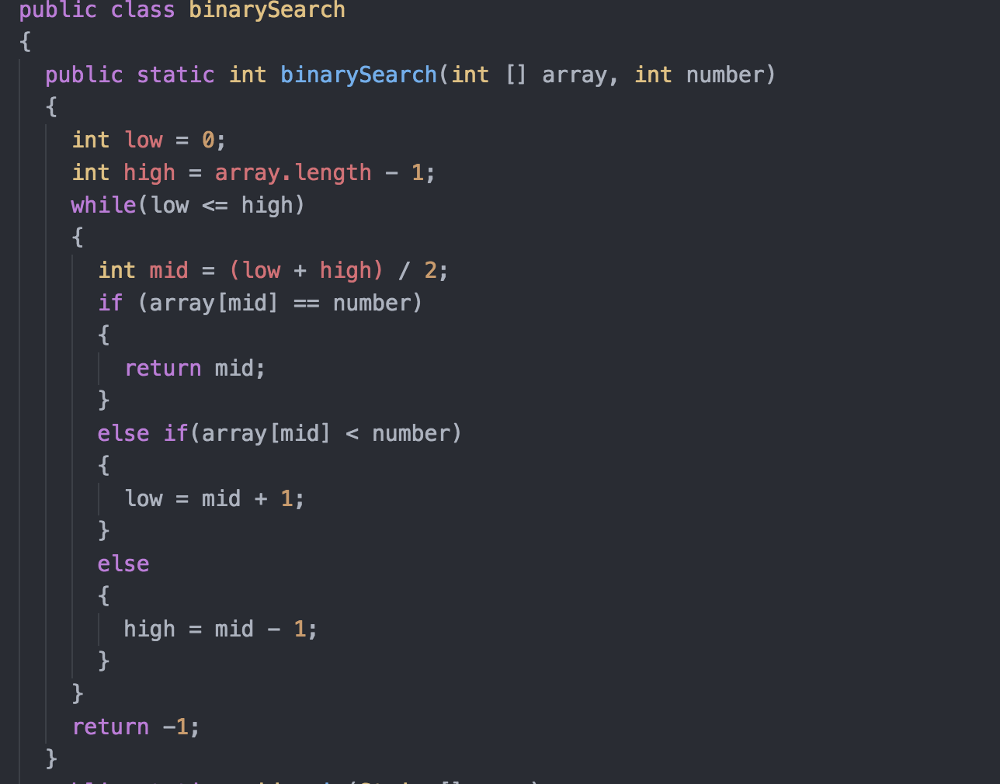

# Binary Search
## How does binary search work?
Binary search works when there is a pre-sorted array of numbers, either integers or doubles, and a target/key number that is being searched for. To explain the process as simply as possible, binary search just divides the array by 2 and returning the index of the target/key number in the array that is passed in the binary search method.
## Example code of how it works

